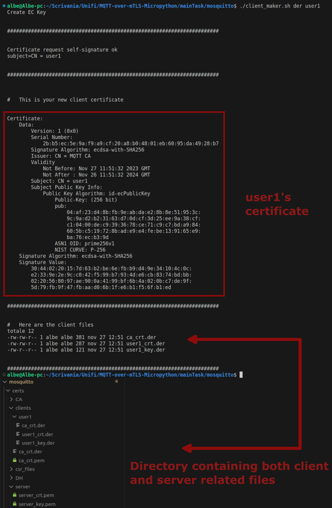
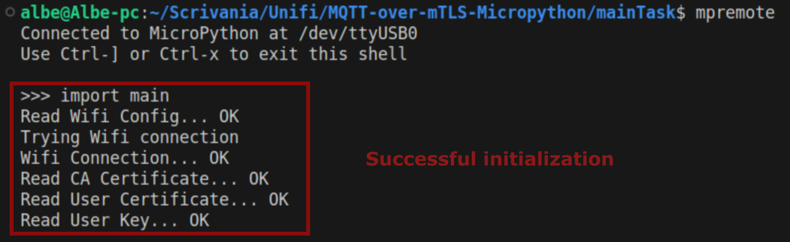

# MQTT-over-mTLS-Micropython

  
Table of Contents

  <ol>
    <li><a href="#about">About</a></li>
    <li>
      <a href="#getting-started">Getting Started</a>
      <ul>
        <li><a href="#prerequisites">Prerequisites</a></li>
        <li><a href="#Configuration">Configuration</a></li>
      </ul>
    </li>
    <li><a href="#usage">Usage</a></li>
    <li><a href="#evaluation-of-possible-authentication-protocols">Evaluation of possible authentication protocols</a></li>
    <li><a href="#extra">Extra</a></li>
  </ol>

## About
This project aims to address the challenge of **security in the connection between an embedded device**, in this case an ESP32 running Micropython, **and its host**, which can be a local or cloud-based broker. The main goal is to ensure secure communication through **robust authentication**. In the next section we will **explore the different options** considered to solve the problem. These options include the use of username and password, passkeys, connections through VPNs, and the implementation of mTLS (Mutual Transport Layer Security). For each of these solutions, advantages and disadvantages will be analyzed in order to identify the strategy best suited to the specific needs of the project. In the following section, detailed **guidance on implementing the solution based on mTLS and MQTT** (with a local Mosquitto broker) will be provided. The guide will include key steps for proper configuration, providing practical support for implementation. Finally, to concretely illustrate the application of the proposed solution, a practical example of using the prototype will be presented. This example will provide a possible starting point for implementation in similar projects.

## Getting Started

### Prerequisites

- [Mycropython](https://micropython.org/download/)
- [esptool](https://github.com/espressif/esptool/)
- [mpremote](https://docs.micropython.org/en/latest/reference/mpremote.html) 
- [Mosquitto](https://mosquitto.org/download/)

### Configuration
Clone the [project directory](https://github.com/jcpdmr/MQTT-over-mTLS-Micropython). First, within the `MQTT-over-mTLS-Micropython-main` directory we create a file called `wifi.conf`. This will contain the parameters needed to connect our device
with an existing wifi network. 
Inside we find:
 -  `wifi_ssid`: Contains the name of the wifi network we are going to connect to - wifi_psw: Contains the network's login password
- `server_ip`: Address of the device on which mosquitto is active
- `server_port`: Reference port of mosquitto (e.g. 8883).

Now let's move inside `MQTT-over-mTLS-Micropython-main/mainTask/mosquitto` then run mosquito with the following command: `mosquitto -v -c mosquitto.conf`
This command will run mosquitto following the `mosquito.conf` configuration like:
 - `per_listener_settings [true]`: Enables specific settings for each connected device, allowing custom configurations for each port or network interface
- `persistence [true]`: Enables message persistence, allowing Mosquitto to store sent and received messages on disk so that they can be retrieved even after a broker restart
- `persistence_file [mosquitto.db]`: Specifies the name of the storage file where Mosquitto will save the log messages
- `persistence_location [./]`: Specifies the directory where the log file will be created.
- `autosave_interval [300]`: Sets the interval at which message logs will be run. In this case it is 300 seconds (5 minutes)
- `retain_available [true]`: Enables the handling of "retain" messages, which are messages memo- rized and sent to new devices when they connect
- `log_timestamp_format [%Y-%m-%d_%H:%M:%S]`: Specifies the format of the timestamp in Mosquitto logs
- `listener [8883]`: Specifies the port (8883) for secure MQTT connections via SSL/TLS
- `socket_domain [ipv4]`: Specifies that the listener will use the IPv4 address domain.
- `require_certificate [true]`: Requires the presentation of a certificate during the SSL/TLS handshake phase.

## Usage
We open the `mainTask/mosquitto/ca_maker.sh` script and change the `subject_cn` variable to the ip address of the host on which we are going to run the mosquitto broker.
In the proposed case, the address associated with the machine is `192.168.1.22`.
Next we execute the script.

   

 

We run the `mainTask/mosquitto/client_maker.sh` script with `der user1` arguments in order to generate the certificate for client `user1`.

   

 

We connect the esp32 (with micropython already flashed) and create the file `mainTask/micropython_data/wifi.conf` following the instructions explained earlier in the configuration.
We then run `mainTask/loader.sh` indicating `user1` as the user.

   

 

We start mosquitto with the configuration `mainTask/mosquitto/mosquitto.conf`

   

 

We open a repl interface on the esp32 via the mpremote utility and import the `main.py` to perform the initialization.

   

 

We start the connection to the broker by running the `start_client()` function again through the repl interface.

   

## Evaluation of possible authentication protocols
The following solutions for authentication were considered:

- **Username and password** represent a commonly used authentication method. Several advantages follow with this approach including ease of implementation and interoperability i.e., ensuring operation with various existing systems. However, this method has the disadvantage of being easily vulnerable. Indeed, credentials based on user and password are subject to threats such as brute force or dictionary attacks, making the system vulnerable if the passwords are weak or predictable. In addition, we should also encrypt the communication channel to avoid man-in-the-middle attacks and keep the passwords used safe. Finally, the user-password scheme is risky in case we have to manage groups of users who share common characteristics: in fact, the administrator could be led to use the same password for a group of devices, creating an additional point of vulnerability.

- **Passkey** as an authentication method is an interesting alternative to classic user credentials and passwords. In passkey, an a priori generated key is used and shared between the device to be controlled and a second device. Sharing can take place through various modes, such as display on a monitor or transmission through a mobile app. Regardless, the fundamental goal is to ensure that the key reaches the second device reliably and that only the relevant user is able to access it. Whenever the user wishes to interact with the IoT device, they will have to provide their key. In this way, communication will take place only if the key provided by the user exactly matches the key stored in the device. With this approach we find several advantages including resistance to brute-force attacks (the keys used are complex and robust).

- **Virtual Private Network (VPN)** represents an advanced approach to secure communications between two devices. What we achieve is precisely a direct, secure and reliable communication channel between devices. With this approach we find several advantages including end-to-end encryption and security over untrusted networks. Infact by coming up with a point-to-point connection between of two devices,the communication with the device would still remain secure even ifd the user connect inside untrusted networks. VPN also allows for the secure use of external services for device management, such as cloud brokers. The use of VPNs, however, have the disadvantage of requiring a fair amount of computational resources.

- **Mutual Transport Layer Security (mTLS)** can be used to secure communications between client and server. The main difference between TLS and mTLS lies in the fact that mTLS involves two-way identity verification during the TLS handshake. In an mTLS context, both client and server must authenticate each other before communication can take place, and this authentication process is handled through the use of digital certificates. The use of mTLS, in addition to all the positive aspects of TLS, also carries the advantage of avoiding man-in-the-middle attacks since both parties must authenticate each other. One of the possible disadvantages of this protocol lies in the issuance and management of certificates over time.

The **username-password authentication method**, as is now well known, **presents many points of vulnerability** and has therefore been discarded in favor of more robust solutions. The use of **passkeys** appears to be one of the fastest growing trends at present due to its **strong versatility and protection effectiveness**. Unfortunately, there are currently **no implementations for micropython of such a protocol**, so a dedicated library would have to be developed. The use of a **VPN** would be another **excellent solution**, however in the case under consideration where there are **devices with scarce computational resources the use of VPN would create a potential impact on device performance**. In addition, again there is no implementation of VPN use in micropython, so it would have to be created. The use of **mTLS is a perfect authentication solution for the use case** and is also **easier to implement in micropython**. For the combination of these reasons, the choice came down to mTLS.

## Extra
In the folder `buttonsBoard` we designed a basic UI that utilized three buttons and the oled screen embedded on the [Heltec WiFi LoRa 32 V2](https://resource.heltec.cn/download/Manual%20Old/WiFi%20Lora32Manual.pdf)

